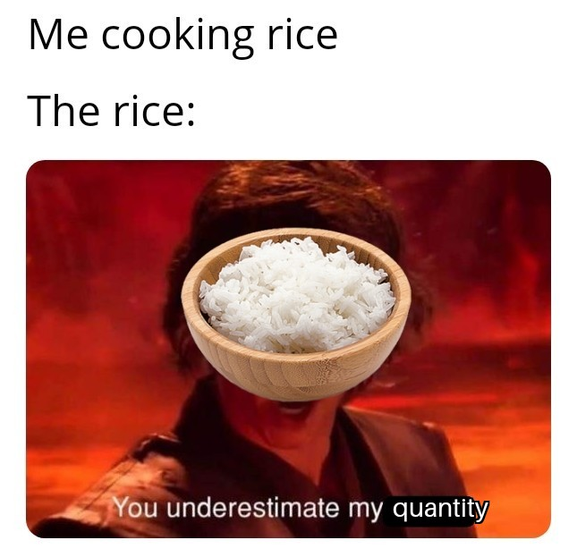

<p align="center">
    <h1 align="center">:ear_of_rice: :rice: Image Classification of Rice :rice: :ear_of_rice: </h1>
    <h4 align="center">Repository for the final project - course <a href="https://kurser.dtu.dk/course/02476">02476</a> at DTU</h4>
</p>

<p align="center">
  
</p>


# :book: Table of Contents

<details open="open">
  <summary>Table of Contents</summary>
  <ol>
    <li><a href="#mortar_board-project-description"> ➤ Project Description</a></li>
    <li><a href="#hammer_and_wrench-installation"> ➤ Installation</a></li>
    <li><a href="#rocket-usage"> ➤ Usage</a></li>
    <li><a href="#scroll-report"> ➤ Report </a></li>
    <li><a href="#file_folder-project-organization"> ➤ Project Organization </a></li>
    <li><a href="#wave-contributors"> ➤ Contributors </a></li>
    <li><a href="#pray-credits"> ➤ Credits </a></li>
    <li><a href="#key-license"> ➤ License </a></li>
  </ol>
</details>


# :mortar_board: Project Description

1. **Overall goal:**
  The goal is to classify five different varieties of rice (Arborio, Basmati, Ipsala, Jasmine and Karacadag). A framework and model(s) is chosen alongside a simple dataset, to focus on the utilization and implementation of frameworks and tools within MLOps. The main focus will thus be on reproducability, profiling, visualizing and monitoring multiple experiments to assess model performance.

2. **Framework:**
  For the project the [PyTorch Image Models](https://github.com/huggingface/pytorch-image-models) (TIMM) is being used. This is a framework/collection of models with pretrained weights, data-loaders, traning/validation scripts, and more to be used for multiple different models.

3. **Data:**
  The rice image [dataset](https://www.kaggle.com/datasets/muratkokludataset/rice-image-dataset/data) publicly available on Kaggle contains 75.000 images with 15.000 pieces for each of the 5 classes. The total size of the dataset is 230MB. Each image is 250 x 250 pixels with a single grain of rice against a black background.

4. **Deep learning models used?**
  For the classification process we will use two different Convolutional Neural Network, comparing the best and the worst network, EVA and MobileNet-V3 respectively based on the ImageNet validataion set. [(reference)](https://github.com/huggingface/pytorch-image-models/blob/main/results/results-imagenetv2-matched-frequency.csv)

## Project structure

The directory structure of the project looks like this:

```txt
├── Makefile             <- Makefile with convenience commands like `make data` or `make train`
├── README.md            <- The top-level README for developers using this project.
├── data
│   ├── processed        <- The final, canonical data sets for modeling.
│   └── raw              <- The original, immutable data dump.
│
├── docs                 <- Documentation folder
│   │
│   ├── index.md         <- Homepage for your documentation
│   │
│   ├── mkdocs.yml       <- Configuration file for mkdocs
│   │
│   └── source/          <- Source directory for documentation files
│
├── models               <- Trained and serialized models, model predictions, or model summaries
│
├── notebooks            <- Jupyter notebooks.
│
├── pyproject.toml       <- Project configuration file
│
├── reports              <- Generated analysis as HTML, PDF, LaTeX, etc.
│   └── figures          <- Generated graphics and figures to be used in reporting
│
├── requirements.txt     <- The requirements file for reproducing the analysis environment
|
├── requirements_dev.txt <- The requirements file for reproducing the analysis environment
│
├── tests                <- Test files
│
├── mlops_group8  <- Source code for use in this project.
│   │
│   ├── __init__.py      <- Makes folder a Python module
│   │
│   ├── data             <- Scripts to download or generate data
│   │   ├── __init__.py
│   │   └── make_dataset.py
│   │
│   ├── models           <- model implementations, training script and prediction script
│   │   ├── __init__.py
│   │   ├── model.py
│   │
│   ├── visualization    <- Scripts to create exploratory and results oriented visualizations
│   │   ├── __init__.py
│   │   └── visualize.py
│   ├── train_model.py   <- script for training the model
│   └── predict_model.py <- script for predicting from a model
│
└── LICENSE              <- Open-source license if one is chosen
```

Created using [mlops_template](https://github.com/SkafteNicki/mlops_template), a [cookiecutter template](https://github.com/cookiecutter/cookiecutter) for getting started with Machine Learning Operations (MLOps).


# :hammer_and_wrench: Installation
TBD: To be decided

**Local environment**
Run the following:
```bash
cd dtu-02476-mlops
make create_environment
conda activate mlops_group8
make requirements
```


# :rocket: Usage
TBD

**Pre-commit**
Enable the pre-commit
```bash
pre-commit install
```
Check the commit with pre-commit
```bash
pre-commit run --all-files
```

After this you can commit as normally.
To omit/skip the pre-commit use:
```bash
git commit -m "<message>" --no-verify
```

**Timm**
To see `eva` models available (use different model names if needed):
```bash
python -c "import timm; print(timm.list_models('*eva*'))"
```
Choose a model with size 224 (to match the image size in the pipeline)

**Data**
Pull from Google Cloud Bucket:
```bash
dvc pull
```

Create locally from Kaggle dataset:
1. Have the `Rice_Image_Dataset` folder saved to `data/raw`

2. *Kaggle API:*
  - Go to [www.kaggle.com](www.kaggle.com) and log in
  - Go to Settings -> API -> Create new token
  - Save the json file to your local `home/user/.kaggle` folder

3. Run the make_dataset file
```bash
make data
```

**Training**
```bash
make train
```

**Evaluate**
NB: You need a model in `models` folder and specify this in your `config` file.

```bash
make evaluate
```

**Predict**
NB: You need a model in `models` folder and specify this in your `config` file.

```bash
python mlops_group8/predict_model.py predict data/raw/Arborio/Arborio\ \(1\).jpg
```

```bash
make predict_test
```


# :scroll: Report
The report for the course is found in the [reports](reports/) folder.


# :file_folder: Project Organization
TBD


# :wave: Contributors
This project exists thanks to the following contributors:

<!-- readme: contributors -start -->
<table>
<tr>
    <td align="center">
        <a href="https://github.com/Lucasmogsan">
            
            <br />
            <sub><b>Lucas Sandby</b></sub>
        </a>
    </td>
    <td align="center">
        <a href="https://github.com/Tran97">
            
            <br />
            <sub><b>Steven</b></sub>
        </a>
    </td>
    <td align="center">
        <a href="https://github.com/esquivelrs">
            
            <br />
            <sub><b>Esquivelrs</b></sub>
        </a>
    </td>
    <td align="center">
        <a href="https://github.com/yufanana">
            
            <br />
            <sub><b>Yufan</b></sub>
        </a>
    </td></tr>
</table>
<!-- readme: contributors -end -->


# :pray: Credits
TBD


# :key: License
TBD

<p align="center">
  
</p>
