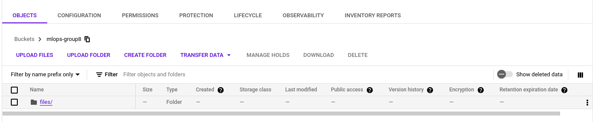
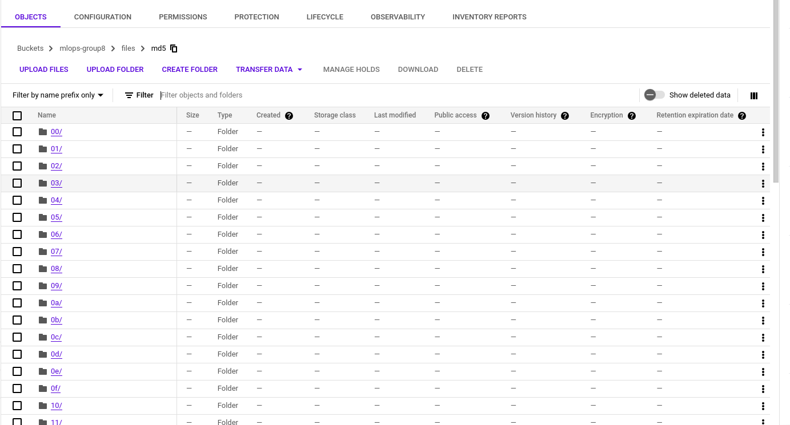
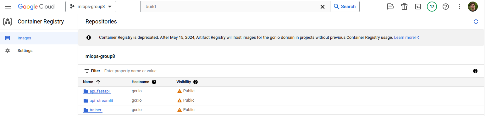
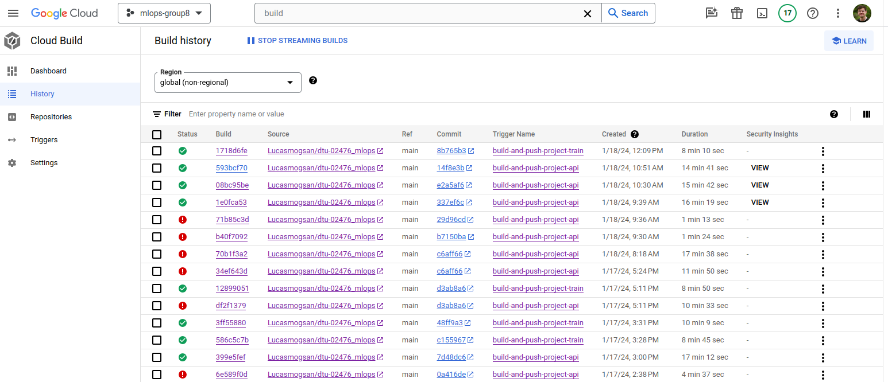

# Exam template for 02476 Machine Learning Operations

This is the report template for the exam. Please only remove the text formatted as with three dashes in front and behind
like:

```--- question 1 fill here ---```

where you instead should add your answers. Any other changes may have unwanted consequences when your report is auto
generated in the end of the course. For questions where you are asked to include images, start by adding the image to
the `figures` subfolder (please only use `.png`, `.jpg` or `.jpeg`) and then add the following code in your answer:

```markdown

```

In addition to this markdown file, we also provide the `report.py` script that provides two utility functions:

Running:

```bash
python report.py html
```

will generate an `.html` page of your report. After deadline for answering this template, we will autoscrape
everything in this `reports` folder and then use this utility to generate an `.html` page that will be your serve
as your final handin.

Running

```bash
python report.py check
```

will check your answers in this template against the constrains listed for each question e.g. is your answer too
short, too long, have you included an image when asked to.

For both functions to work it is important that you do not rename anything. The script have two dependencies that can
be installed with `pip install click markdown`.

## Overall project checklist

The checklist is *exhaustic* which means that it includes everything that you could possible do on the project in
relation the curricilum in this course. Therefore, we do not expect at all that you have checked of all boxes at the
end of the project.

### Week 1

* [X] Create a git repository
* [X] Make sure that all team members have write access to the github repository
* [X] Create a dedicated environment for you project to keep track of your packages
* [X] Create the initial file structure using cookiecutter
* [X] Fill out the `make_dataset.py` file such that it downloads whatever data you need and
* [X] Add a model file and a training script and get that running
* [X] Remember to fill out the `requirements.txt` file with whatever dependencies that you are using
* [X] Remember to comply with good coding practices (`pep8`) while doing the project
* [X] Do a bit of code typing and remember to document essential parts of your code
* [X] Setup version control for your data or part of your data
* [ ] Construct one or multiple docker files for your code
* [ ] Build the docker files locally and make sure they work as intended
* [X] Write one or multiple configurations files for your experiments
* [X] Used Hydra to load the configurations and manage your hyperparameters
* [ ] When you have something that works somewhat, remember at some point to to some profiling and see if
      you can optimize your code
* [ ] Use Weights & Biases to log training progress and other important metrics/artifacts in your code. Additionally,
      consider running a hyperparameter optimization sweep.
* [ ] Use Pytorch-lightning (if applicable) to reduce the amount of boilerplate in your code

### Week 2

* [ ] Write unit tests related to the data part of your code
* [ ] Write unit tests related to model construction and or model training
* [ ] Calculate the coverage.
* [ ] Get some continuous integration running on the github repository
* [X] Create a data storage in GCP Bucket for you data and preferable link this with your data version control setup
* [ ] Create a trigger workflow for automatically building your docker images
* [ ] Get your model training in GCP using either the Engine or Vertex AI
* [ ] Create a FastAPI application that can do inference using your model
* [ ] If applicable, consider deploying the model locally using torchserve
* [ ] Deploy your model in GCP using either Functions or Run as the backend

### Week 3

* [ ] Check how robust your model is towards data drifting
* [ ] Setup monitoring for the system telemetry of your deployed model
* [ ] Setup monitoring for the performance of your deployed model
* [ ] If applicable, play around with distributed data loading
* [ ] If applicable, play around with distributed model training
* [ ] Play around with quantization, compilation and pruning for you trained models to increase inference speed

### Additional

* [ ] Revisit your initial project description. Did the project turn out as you wanted?
* [ ] Make sure all group members have a understanding about all parts of the project
* [ ] Uploaded all your code to github

## Group information

### Question 1
> **Enter the group number you signed up on <learn.inside.dtu.dk>**
>
> Answer:

Group 8

### Question 2
> **Enter the study number for each member in the group**
>
> Answer:

*s223093, s223189, s230025, s230003*

### Question 3
> **What framework did you choose to work with and did it help you complete the project?**
>
> Answer length: 100-200 words.
>
> Example:
> *We used the third-party framework ... in our project. We used functionality ... and functionality ... from the*
> *package to do ... and ... in our project*.
>
> Answer:

For the project the [PyTorch Image Models](https://github.com/huggingface/pytorch-image-models) (TIMM) is used to access the model architecture of various deep learning models, specifically the EVA CNN model. Only the functionality of getting the model architecture was used for training as both model and weights could then be saved to a generic `.pt` file which is loaded for the inference. This made it really easy as we could use a more or less standard training and inference pipeline. Using the framework made it easier to make a good model, but it would not have been a huge task creating a simple moel ourselves instead. However it was a good exercise to use third party frameworks such as TIMM.

## Coding environment

> In the following section we are interested in learning more about you local development environment.

### Question 4

> **Explain how you managed dependencies in your project? Explain the process a new team member would have to go**
> **through to get an exact copy of your environment.**
>
> Answer length: 100-200 words
>
> Example:

> *We used ... for managing our dependencies. The list of dependencies was auto-generated using ... . To get a*
> *complete copy of our development environment, one would have to run the following commands*
>
> Answer:

The Python dependencies were saved within the requirements file using pipreqs, a tool that exclusively records the utilized packages in the project. Each team member subsequently employed a virtual environment manager of their choosing, with some opting for conda, others for virtualenv, or simply the venv module. Within this designated environment, members installed the dependencies utilizing the requirements file.

Establishment of a development container was also experimented with, seeking a fully reproducible development environment containing GCP packages and other dependencies. However, the process encountered intricacies, primarily stemming from the management of GCP authorization.

### Question 5

> **We expect that you initialized your project using the cookiecutter template. Explain the overall structure of your**
> **code. Did you fill out every folder or only a subset?**
>
> Answer length: 100-200 words
>
> Example:
> *From the cookiecutter template we have filled out the ... , ... and ... folder. We have removed the ... folder*
> *because we did not use any ... in our project. We have added an ... folder that contains ... for running our*
> *experiments.*
> Answer:

We used the cookiecutter [`MLOps template`](https://github.com/SkafteNicki/mlops_template) but did change the structure along the way by restructuring e.g. the docker files and added the `.dvc` folder. Additionally in the project folder a `config` folder is added for the config files used by Hydra and a `utility` folder is added for minor utility scripts used for various other scripts as well as scripts used for testing various stuff like connecting to wandb (no pytests in this folder). The `models` and `visualizations` folders are removed as the model is replaced by using the TIMM framework and the visualizations are generated in wandb. For minor tests etc. a `misc` folder is added. Furthermore and `output` folder is added for coverage reports, hydra config logs, and wandb logs. Also, additional `requirements files` are implemented to be used for the docker images in order to minimize the size of training and prediction image.

### Question 6

> **Did you implement any rules for code quality and format? Additionally, explain with your own words why these**
> **concepts matters in larger projects.**
>
> Answer length: 50-100 words.
>
> Answer:

TODO: Yu Fan
Ruff was used for code checking. Code check is activated using pre-commits and pull requests to the main branch. Other hooks in the pre-commit includes add-trailing-comma, trailing-whitespaces, and mypy static type checker. Having these rules improve readability for other users and helps catch bugs early on before they are pushed to the repository.

## Version control

> In the following section we are interested in how version control was used in your project during development to
> corporate and increase the quality of your code.

### Question 7

> **How many tests did you implement and what are they testing in your code?**
>
> Answer length: 50-100 words.
>
> Example:
> *In total we have implemented X tests. Primarily we are testing ... and ... as these the most critical parts of our*
> *application but also ... .*
>
> Answer:

TODO: Yu Fan
In total, 7 tests were implemented for the data, model, and training. The data tests checked if the images and labels are loaded with the correct shapes. The training tests checked if the hydra configuration is loaded correctly, and it runs 3 training epochs to check for decreasing training loss. The model tests checks for correct input and output tensor shapes from the model, using `pytest.raises()`.

### Question 8

> **What is the total code coverage (in percentage) of your code? If you code had an code coverage of 100% (or close**
> **to), would you still trust it to be error free? Explain you reasoning.**
>
> Answer length: 100-200 words.
>
> Example:
> *The total code coverage of code is X%, which includes all our source code. We are far from 100% coverage of our **
> *code and even if we were then...*
>
> Answer:

TODO: Yu Fan
The total code coverage of the source code is X%. If instead it was closer to 100%, it cannot be trusted to be error free as other forms of tests like integration tests are required.

### Question 9

> **Did you workflow include using branches and pull requests? If yes, explain how. If not, explain how branches and**
> **pull request can help improve version control.**
>
> Answer length: 100-200 words.
>
> Example:
> *We made use of both branches and PRs in our project. In our group, each member had an branch that they worked on in*
> *addition to the main branch. To merge code we ...*
>
> Answer:

TODO: Yu Fan & Steven
Both branches and PRs (pull requests) were used in this project. When a new feature is implemented, a new branch was created. Instead of everyone working on main and pushing directly to main, working on branches provided some security and

### Question 10

> **Did you use DVC for managing data in your project? If yes, then how did it improve your project to have version**
> **control of your data. If no, explain a case where it would be beneficial to have version control of your data.**
>
> Answer length: 100-200 words.
>
> Example:
> *We did make use of DVC in the following way: ... . In the end it helped us in ... for controlling ... part of our*
> *pipeline*
>
> Answer:

We used DVC to manage the data in our project, following the guide provided in the course and applying the commands: `dvc add -> git add -> git commit -> git tag -> dvc push -> git push`. Initially, the data was pushed to a Google Drive folder, but due to authentication requirements, we moved the data to a bucket in Google Cloud Storage. We also decided to store the trained models in a separate bucket to keep track of them. For this, we created two configurations: `['remote "remote_storage"']` and `['remote "remote_storage_models_train"']`. Using a centralized storage area and keeping track of the data helped us maintain consistency in our results, as all team members used the same processed data. It also helped us to manage the data effectively.


### Question 11

> **Discuss you continues integration setup. What kind of CI are you running (unittesting, linting, etc.)? Do you test**
> **multiple operating systems, python version etc. Do you make use of caching? Feel free to insert a link to one of**
> **your github actions workflow.**
>
> Answer length: 200-300 words.
>
> Example:
> *We have organized our CI into 3 separate files: one for doing ..., one for running ... testing and one for running*
> *... . In particular for our ..., we used ... .An example of a triggered workflow can be seen here: <weblink>*
>
> Answer:

TODO: Yu Fan
--- question 11 fill here ---

When a pull request was created to merge with main, at least one other team member was required to do a review of the code. Code check with Ruff and unit test workflows were set up as part of CI ([link](https://github.com/Lucasmogsan/dtu-02476_mlops/actions/workflows/codecheck.yml)). The workflows were tested on Windows-latest and Ubuntu-latest OS, with py3.11. Caching was used to speed up the dependencies installation, especially for the unit test workflow.

## Running code and tracking experiments

> In the following section we are interested in learning more about the experimental setup for running your code and
> especially the reproducibility of your experiments.

### Question 12

> **How did you configure experiments? Did you make use of config files? Explain with coding examples of how you would**
> **run a experiment.**
>
> Answer length: 50-100 words.
>
> Example:
> *We used a simple argparser, that worked in the following way: python my_script.py --lr 1e-3 --batch_size 25*
>
> Answer:

Hydra was used to set up configurations. There is a `default_config.yaml` file specifying the experiment number. And there are separate yaml files like `exp1.yaml`, `exp2.yaml` containing the hyperparameters for each experiment. A sample config file looks like below.

``` yaml
dataset_path: 'data/processed'
batch_size: 64
epochs: 3
lr: 1e-3
seed: 123
model_name: 'model_latest'
classes: [0,1,2,3,4]
test_size: 0.2
val_size: 0.25
n_samples: 500
```

By changing the naming and having e.g. `exp1_training.yaml` we made sure to keep track of which ones was more used for training and which ones for prediction etc. Additionally this information (hydra file used, scripts being run etc) will after each run be stored in the outputs folder.

### Question 13

> **Reproducibility of experiments are important. Related to the last question, how did you secure that no information**
> **is lost when running experiments and that your experiments are reproducible?**
>
> Answer length: 100-200 words.
>
> Example:
> *We made use of config files. Whenever an experiment is run the following happens: ... . To reproduce an experiment*
> *one would have to do ...*
>
> Answer:

TODO: Yu Fan & Lucas
Hydra generates an output to log the config used for each training run, allowing users to trace the history of their experiments. A seed to initialize torch was included in the configuration file. Also, parameters used to create the datasets are included to reproduce identical datasets.

### Question 14

> **Upload 1 to 3 screenshots that show the experiments that you have done in W&B (or another experiment tracking**
> **service of your choice). This may include loss graphs, logged images, hyperparameter sweeps etc. You can take**
> **inspiration from [this figure](figures/wandb.png). Explain what metrics you are tracking and why they are**
> **important.**
>
> Answer length: 200-300 words + 1 to 3 screenshots.
>
> Example:
> *As seen in the first image when have tracked ... and ... which both inform us about ... in our experiments.*
> *As seen in the second image we are also tracking ... and ...*
>
> Answer:

TODO: Yu Fan
--- question 14 fill here ---

### Question 15

> **Docker is an important tool for creating containerized applications. Explain how you used docker in your**
> **experiments? Include how you would run your docker images and include a link to one of your docker files.**
>
> Answer length: 100-200 words.
>
> Example:
> *For our project we developed several images: one for training, inference and deployment. For example to run the*
> *training docker image: `docker run trainer:latest lr=1e-3 batch_size=64`. Link to docker file: <weblink>*
>
> Answer:

In our project, we utilized Docker containers at multiple stages of the pipeline. We created three Docker images: one for training, one for the FastAPI app, and one for the Streamlit app. The training image automatically runs the training process upon container initialization, generating a model file and pushing it to the Google Cloud Storage bucket. The containers dedicated to the apps run the corresponding scripts, enabling users to utilize the models and classify rice images.

By using these Docker containers, we were able to maintain reproducibility and consistency in our results.

Docker container images:
1. [Training](../docker/train/Dockerfile)
2. [FastApi](../docker/api_fastapi/Dockerfile)
3. [Streamlit](../docker/api_streamlit/Dockerfile)


### Question 16

> **When running into bugs while trying to run your experiments, how did you perform debugging? Additionally, did you**
> **try to profile your code or do you think it is already perfect?**
>
> Answer length: 100-200 words.
>
> Example:
> *Debugging method was dependent on group member. Some just used ... and others used ... . We did a single profiling*
> *run of our main code at some point that showed ...*
>
> Answer:

The main bugs we have had have been due to access and integration to gcp or GitHub not the code itself. Regarding the coding bugs the whole group have been using the VSCode debugger as well as some from the group have been using the integrated Copilot chat function to VSCode.

We did run profiling on the training and inference to see if we could decrease the time. However profiling the training script showed (as expected) that the model architecture is strictly speaking the only factor adding to increased training time and thus the profiling itself wasn't that interesting. As expected using a larger train dataset or more epoch naturally increased the training time which could be evaluated by comparing the two profilings.


## Working in the cloud

> In the following section we would like to know more about your experience when developing in the cloud.

### Question 17

> **List all the GCP services that you made use of in your project and shortly explain what each service does?**
>
> Answer length: 50-200 words.
>
> Example:
> *We used the following two services: Engine and Bucket. Engine is used for... and Bucket is used for...*
>
> Answer:

In the project we made use of the following five services directly while some services (e.g. Compute Engine) is used indirectly:
- **Buckets** for storing the (training) data and model (.pt files).
- **Container Registry** for storing Docker images.
- **Trigger** for automatically building the Docker images from dockerfiles from the GitHub repository.
- **Vertex AI** for running the training (running the images - including pulling data, running the training script, and pushing the trained model).
- **Cloud Run** for hosting the inference API (running the fastapi and streamlit images - including pulling the model, gets the user input from the API to save it locally, and runs the prediction script which outputs the result).

### Question 18

> **The backbone of GCP is the Compute engine. Explained how you made use of this service and what type of VMs**
> **you used?**
>
> Answer length: 100-200 words.
>
> Example:
> *We used the compute engine to run our ... . We used instances with the following hardware: ... and we started the*
> *using a custom container: ...*
>
> Answer:

As mentioned we didn't actually use the Compute Engines / VMs directly as we were able to do the preliminary tests locally on small datasets. However using the compute engines as a part of the Vertex AI was really beneficial as both storage and computational capabilities are much more flexible. We used the n1-highmem-2 machine type (vCPU). This was not much faster than our local computers but being able to run the training in the cloud made it possible to progress on other stuff meanwhile. It would be interesting optimizing and accelerating the training with GPU supported machines for further work.

In addition, we used the Cloud Run service to host the applications for prediction, both services run docker container with the applications.

### Question 19

> **Insert 1-2 images of your GCP bucket, such that we can see what data you have stored in it.**
> **You can take inspiration from [this figure](figures/bucket.png).**
>
> Answer:

This is the bucket for the data (we used DVC to manage the data)):
<p align="center">
  
</p>

<p align="center">
  
</p>

### Question 20

> **Upload one image of your GCP container registry, such that we can see the different images that you have stored.**
> **You can take inspiration from [this figure](figures/registry.png).**
>
> Answer:

TODO: Lucas update this?
<p align="center">
  
</p>

### Question 21

> **Upload one image of your GCP cloud build history, so we can see the history of the images that have been build in**
> **your project. You can take inspiration from [this figure](figures/build.png).**
>
> Answer:

TODO: Lucas update this?

<p align="center">
  
</p>

### Question 22

> **Did you manage to deploy your model, either in locally or cloud? If not, describe why. If yes, describe how and**
> **preferably how you invoke your deployed service?**
>
> Answer length: 100-200 words.
>
> Example:
> *For deployment we wrapped our model into application using ... . We first tried locally serving the model, which*
> *worked. Afterwards we deployed it in the cloud, using ... . To invoke the service an user would call*
> *`curl -X POST -F "file=@file.json"<weburl>`*
>
> Answer:

After the model has been trained and certified to meet the acceptance criteria, it is pushed to a designated 'release bucket'. This bucket contains the most recent and advanced model. Two separate applications utilize the model. One of the applications uses FastAPI that can be invoked by using this command: *`curl -X 'POST' 'https://gcp-group8-app-yhdjmsx7ja-ew.a.run.app/predict/' -F 'data=@image.jpg'`*. And the second application is intended to provide an interactive use of the model, by running a Streamlit-based app that can be accessed on this [Link](https://gcp-group8-api-st-yhdjmsx7ja-ew.a.run.app/)

These two applications operate in separate Docker containers. Initially, these containers were enabled locally and subsequently deployed as services on Google Cloud Run using a manual trigger in cloud build.


### Question 23

> **Did you manage to implement monitoring of your deployed model? If yes, explain how it works. If not, explain how**
> **monitoring would help the longevity of your application.**
>
> Answer length: 100-200 words.
>
> Example:
> *We did not manage to implement monitoring. We would like to have monitoring implemented such that over time we could*
> *measure ... and ... that would inform us about this ... behaviour of our application.*
>
> Answer:

TODO: All - Maybe implement?
--- question 23 fill here ---

### Question 24

> **How many credits did you end up using during the project and what service was most expensive?**
>
> Answer length: 25-100 words.
>
> Example:
> *Group member 1 used ..., Group member 2 used ..., in total ... credits was spend during development. The service*
> *costing the most was ... due to ...*
>
> Answer:

As of wednesday afternoon including credits used for the exercises:
- Group member 1 used 5 $ (from this account we ran triggers and VertexAI and stored container registry)
- Group member 2 used 20 $ (from this account we stored the buckets and ran the Cloud Run)
- Group member 3 used 33 $ (account mainly used for exercises - some buckets drained the budget...)
- Group member 4 used 1 $ (account mainly used for exercises)

## Overall discussion of project

> In the following section we would like you to think about the general structure of your project.

### Question 25

> **Include a figure that describes the overall architecture of your system and what services that you make use of.**
> **You can take inspiration from [this figure](figures/overview.png). Additionally in your own words, explain the**
> **overall steps in figure.**
>
> Answer length: 200-400 words
>
> Example:
>
> *The starting point of the diagram is our local setup, where we integrated ... and ... and ... into our code.*
> *Whenever we commit code and puch to github, it auto triggers ... and ... . From there the diagram shows ...*
>
> Answer:

TODO: All
--- question 25 fill here ---

### Question 26

> **Discuss the overall struggles of the project. Where did you spend most time and what did you do to overcome these**
> **challenges?**
>
> Answer length: 200-400 words.
>
> Example:
> *The biggest challenges in the project was using ... tool to do ... . The reason for this was ...*
>
> Answer:

TODO: Yu Fan maybe write some? Currently: 171 words
The biggest challenges in the project was implementing gcp and administrating access, keys etc. across group members. In general the collaboration made it harder as the workflow - also on git using GitHub - had to be more strictly managed. This also caused some time spent on merging conflicts which however was one of the more simple tasks. To be mentioned is setting up the training pipeline with the training script and image, buckets, and Vertex AI. This was one of the more challenging tasks as it required extensive understanding of multiple aspects and the overall pipeline including access to the buckets and the training image on gcp.

We also encountered issues with DVC performance. The process of uploading and downloading data was extremely slow due to the large number of files (images). As a result, we had to reduce the size of the dataset. Additionally, we changed the DVC setting to `version_aware = false`. This grouped the files in DVC's own format, which helped reduce the number of files uploaded to the bucket.


### Question 27

> **State the individual contributions of each team member. This is required information from DTU, because we need to**
> **make sure all members contributed actively to the project**
>
> Answer length: 50-200 words.
>
> Example:
> *Student sXXXXXX was in charge of developing of setting up the initial cookie cutter project and developing of the*
> *docker containers for training our applications.*
> *Student sXXXXXX was in charge of training our models in the cloud and deploying them afterwards.*
> *All members contributed to code by...*
>
> Answer:

Student s230003 was in charge of setting up the environment including cookue cutter. Additionally s230003 was in charge of implementing both Hydra and WandB as well as the pyTest and GitHub workflows. s230003 was also involved in training and evaluation of the model as well as prediction.
Student s223093 and s223189 were in charge of implementing the whole training pipeline including the docker images, training script and cloud integration using Vertex AI and dvc pull/push from/to gcp bukets. s223093 additionally worked on the evaluation of the model while s223189 was integrating GitHub workflows. s230025 was in charge of the deployment of the models and prediction pipeline including docker images, the back- and front-end APIs, as well as the cloud gcp setup. Also s230025 was in charge of the data preparation.

NB: Everyone from the group has contributed equally and have committed to the project aligned with everyones expectation helping eachother and working together.
